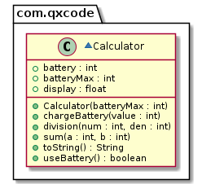

# Calculadora com bateria (solver, manual, diagrama)


<!--TOC_BEGIN-->
- [Requisitos](#requisitos)
- [Shell](#shell)
- [Diagrama](#diagrama)
- [Ajuda](#ajuda)
- [Esqueleto](#esqueleto)
<!--TOC_END-->


O objetivo dessa atividade é implementar uma calculadora a bateria. Se há bateria, ela executa operações de soma, multiplicação e divisão. É possível também mostrar a quantidade de bateria e recarregar a calculadora. Ela avisa quando está sem bateria e se há tentativa de divisão por 0.


***
## Requisitos

- Mostrar bateria da calculadora.
- Recarregar a bateria.
- Realizar operações matemáticas de soma e divisão.
- Se o usuário tentar realizar operações e a bateria estiver vazia, deverá ser mostrada uma notificação sobre falta de bateria.
- Se for tentada divisão por zero, deve ser notificado o erro.

***
## Shell

```bash
#__case iniciar mostrar e recarregar
# O comando "$init M" inicia uma calculadora passando por parâmetro a bateria máxima.
# O comando "$show" mostra o valor da última operação bem sucedida no display e o estado da bateria
# O comando "$charge V" recarrega a bateria de V
$init 5
$show
display = 0.00, battery = 0
$charge 3
$show
display = 0.00, battery = 3
$charge 1
$show
display = 0.00, battery = 4
$charge 2
$show
display = 0.00, battery = 5
$init 4
$charge 2
$show
display = 0.00, battery = 2
$charge 3
$show
display = 0.00, battery = 4
$end	
```	
```bash
#__case somando
$init 2
$charge 2
$sum 4 3
$show
display = 7.00, battery = 1
$sum 2 3
$show
display = 5.00, battery = 0
$sum -4 -1
fail: bateria insuficiente
$charge 1
$show
display = 5.00, battery = 1
$sum -4 -2
$show
display = -6.00, battery = 0
$end
```
```bash
#__case dividindo
$init 3
$charge 3
$div 6 3
$div 7 0
fail: divisao por zero
$show
display = 2.00, battery = 1
$div 7 2
$div 10 2
fail: bateria insuficiente
$show
display = 3.50, battery = 0
$end
```

***
## Diagrama


***
## Ajuda

Você pode formatar floats com duas casas decimais em java usando essa classe

```java
import java.text.*;
  
class Decimals {
  public static void main(String[] args) {
    float f = 125.0f;
    DecimalFormat form = new DecimalFormat("0.00");
    System.out.println(form.format(f));
  }
}
```

***
## Esqueleto
<!--FILTER Solver.java java-->
```java
class Calculator {
    public int batteryMax;
    public int battery;
    public float display;
    //Inicia os atributos, battery e display começam com o zero.
    public Calculator(int batteryMax);
    //Aumenta a bateria, porém não além do máximo.
    public void chargeBattery(int value); 
    //Tenta gastar uma unidade da bateria e emite um erro se não conseguir.
    public boolean useBattery(); 
    //Se conseguir gastar bateria, armazene a soma no atributo display.
    public void sum(int a, int b); 
    //Se conseguir gastar bateria e não for divisão por 0.
    public void division(int num, int den);
    //Retorna o conteúdo do display com duas casas decimais.
    public String toString(); 
}
class Solver{
    public static void main(String[] args) {
        Scanner scanner = new Scanner(System.in);
        Calculator calc = new Calculator(0);
        while(true){
            String line = scanner.nextLine();
            System.out.println("$" + line);
            String ui[] = line.split(" ");
            if(line.equals("end")) {
                break;
            } else if(ui[0].equals("init")) { //batteryMax
                calc = new Calculator(Integer.parseInt(ui[1]));
            } else if(ui[0].equals("show")) {
                System.out.println(calc);
            } else if(ui[0].equals("charge")) {
                calc.chargeBattery(Integer.parseInt(ui[1]));
            } else if(ui[0].equals("sum")) {//value value
                calc.sum(Integer.parseInt(ui[1]), Integer.parseInt(ui[2]));
            } else if(ui[0].equals("div")) {//value value
                calc.division(Integer.parseInt(ui[1]), Integer.parseInt(ui[2]));
            } else {
                System.out.println("fail: comando invalido");
            }
        }
        scanner.close();
    }
}
```
<!--FILTER_END-->

