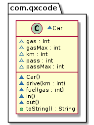

# Carro com pessoas

<!--TOC_BEGIN-->
- [Requisitos](#requisitos)
- [Shell](#shell)
- [Diagrama](#diagrama)
- [Esqueleto](#esqueleto)
<!--TOC_END-->


Essa atividade se propõe a implementar um carro ecológico que pode passear pela cidade. Ele deve poder embarcar e desembarcar pessoas, colocar combustível e andar.


## Requisitos
Seu sistema deverá:

- Inicializar.
    - Iniciar de tanque vazio, sem ninguém dentro e com 0 de quilometragem.
    - Para simplificar, nosso carro esportivo suporta até 2 pessoas e seu tanque suporta até 100 litros de água como combustível.
- Entrando e Saindo.
    - Embarcar uma pessoa por vez.
    - Desembarcar uma pessoa por vez.
        - Não embarque além do limite ou desembarque se não houver ninguém no carro.
- Abastecer.
    - Abastecer o tanque passando a quantidade de litros de combustível.
        - Caso tente abastecer acima do limite, descarte o valor que passou.
- Dirigir.
    - Caso haja pelo menos uma pessoa no carro e **algum combustível**, ele deve gastar combustível andando e aumentar a quilometragem.
    - Nosso carro faz um kilômetro por litro de água.
    - Caso não exista combustível suficiente para completar a viagem inteira, dirija o que for possível e emita uma mensagem indicando quanto foi percorrido.


***
## Shell

```bash
#__case inicializar
# O comando "$in" insere uma pessoa no carro.
# O comando "$out" retira uma pessoa do carro".
# O comando "$show" mostra o estado do carro.
# Deve ser emitido um erro caso não seja possível inserir ou retirar uma pessoa.
$show
pass: 0, gas: 0, km: 0
$in
$in
$show
pass: 2, gas: 0, km: 0
$in
fail: limite de pessoas atingido
$show
pass: 2, gas: 0, km: 0
$out
$out
$out
fail: nao ha ninguem no carro
$show
pass: 0, gas: 0, km: 0
$end
```

```bash
#__case abastecer
$fuel 60
$show
pass: 0, gas: 60, km: 0

#__case dirigir vazio
$drive 10
fail: nao ha ninguem no carro

#__case dirigir
$in
$drive 10
$show
pass: 1, gas: 50, km: 10

#__case para longe
$drive 70
fail: tanque vazio apos andar 50 km
$drive 10
fail: tanque vazio
$show
pass: 1, gas: 0, km: 60

#__case enchendo o tanque
$fuel 200
$show
pass: 1, gas: 100, km: 60
$end
#__end__
```

***
## Diagrama



***
## Esqueleto
<!--FILTER Solver.java java-->
```java
class Car{
    int pass; // Passageiros
    int passMax; // limite de Passageiros
    int gas; // tanque
    int gasMax; // limite do tanque
    int km; // quantidade de quilometragem
    Car();
    public String toString();
    void in();
    void out();
    void fuel(int gas);
    void drive (int km);
};
class Solver{
    public static void main(String[] args) {
        Scanner scanner = new Scanner(System.in);
        Car car = new Car();

        while(true) {
            String line = scanner.nextLine();
            String ui[] = line.split(" ");
            System.out.println("$" + line);
            if(ui[0].equals("end")) {
                break;
            } else if(ui[0].equals("in")) {
                car.in();
            } else if(ui[0].equals("out")) {
                car.out();
            } else if(ui[0].equals("show")) {
                System.out.println(car.toString());
            } else if (ui[0].equals("drive")) {//km
                car.drive(Integer.parseInt(ui[1]));
            } else if (ui[0].equals("fuel")) {//gas
                car.fuel(Integer.parseInt(ui[1]));
            } else{
                System.out.println("fail: comando invalido");
            }
        }
    }
}
class Manual {
    public static void main(String[] args) {
        Car car = new Car();
        System.out.println(car);
        //pass: 0, gas: 0, km: 0
        car.in();
        car.in();
        System.out.println(car);
        //pass: 2, gas: 0, km: 0
        car.in();
        //fail: limite de pessoas atingido
        System.out.println(car);
        //pass: 2, gas: 0, km: 0
        car.out();
        car.out();
        car.out();
        //fail: nao ha ninguem no carro
        System.out.println(car);
        //pass: 0, gas: 0, km: 0

        car = new Car();
        car.fuel(60);
        System.out.println(car);
        //pass: 0, gas: 60, km: 0

        car.drive(10);
        //fail: nao ha ninguem no carro

        car.in();
        car.drive(10);
        System.out.println(car);
        //pass: 1, gas: 50, km: 10

        car.drive(70);
        //fail: tanque vazio apos andar 50 km
        car.drive(10);
        //fail: tanque vazio
        System.out.println(car);
        //pass: 1, gas: 0, km: 60

        car.fuel(200);
        System.out.println(car);
        //pass: 1, gas: 100, km: 60
    }
}
```
<!--FILTER_END-->
