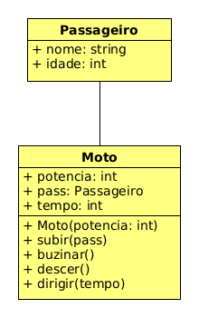

# Motoca infantil no parque


<!--TOC_BEGIN-->
- [Requisitos](#requisitos)
- [Shell](#shell)
- [Ajuda](#ajuda)
- [Diagrama](#diagrama)
- [Esqueleto](#esqueleto)
<!--TOC_END-->

Você já deve ter ido em algum parque e viu crianças de 4 a 10 anos andando naquelas motocas motorizadas. Pois é, nós vamos modelar e implementar uma delas.

## Requisitos

- Você deverá implementar a classe `Pessoa` e a class `Moto`.
- Iniciar
    - A moto inicia com 1 de potência, sem minutos e sem ninguém.
- Subir
    - Só pode estar uma pessoa na moto por vez. Para subir, informe nome e idade de quem está subindo.
- Descer
    - Só pode descer se tiver alguém na moto.
- Comprar tempo
    - O tempo em minutos é comprado e enquanto houver tempo, qualquer pessoa pode dirigir.
- Dirigir tempo
    - Se houver uma pessoa com 10 anos ou menos e houver minutos, então ela pode passear de moto.
    - Se o tempo acabar no meio do passeio, informe o quanto a pessoa andou.
- Buzinar
    - Qualquer pessoa pode buzinar(honk)
    - O barulho da buzina é "Pem", porém o número de `e` é igual ao valor da potência.
    - Ex: se a potência for 5, buzinar deve gerar: Peeeeem


## Shell

```bash

#__case subindo e buzinando
$show
potencia: 1, minutos: 0, pessoa: null
$honk
fail: moto vazia
$in marcos 4
$show
potencia: 1, minutos: 0, pessoa: [marcos:4]
$honk
Pem
$in marisa 2
fail: moto ocupada
$show
potencia: 1, minutos: 0, pessoa: [marcos:4]
$end
```

```bash
#__case subindo e buzinando
$init 5
$show
potencia: 5, minutos: 0, pessoa: null
$in marcos 4
$show
potencia: 5, minutos: 0, pessoa: [marcos:4]
$honk
Peeeeem
$end
```

```bash
#__case subindo e trocando
$init 7
$in heitor 6
$show
potencia: 7, minutos: 0, pessoa: [heitor:6]
$out
$out
fail: moto vazia
$in suzana 8
$show
potencia: 7, minutos: 0, pessoa: [suzana:8]
$end
```

```bash
#__case passeando
$init 7
$in suzana 8
$drive 10
fail: tempo zerado
$buy 40
$show
potencia: 7, minutos: 40, pessoa: [suzana:8]
$drive 20
$show
potencia: 7, minutos: 20, pessoa: [suzana:8]
$end
```

```bash
#__case nem grande nem pequeno
$init 7
$buy 20
$in andreina 23
$drive 15
fail: muito grande para andar de moto
$show
potencia: 7, minutos: 20, pessoa: [andreina:23]
$end
```

```bash
#__case acabou o tempo
$init 7
$buy 20
$in andreina 6
$drive 15
$show
potencia: 7, minutos: 5, pessoa: [andreina:6]
$drive 10
fail: andou 5 min e acabou o tempo
$end
```

***
## Ajuda
    - Lembre de inicializar o objeto `Pessoa` antes de chamar o método embarcar.
    - Para buzinar, utilize o `for` gerando várias vezes o `e`. 

***
## Diagrama



***
## Esqueleto
<!--FILTER Solver.java java-->
```java
class Pessoa {
    String nome;
    int idade;
    Pessoa(String nome, int idade);
    public String toString();
}
class Motoca {
    Pessoa pessoa; //agregacao
    int potencia;
    int tempo;
    //Inicia o atributo potencia, tempo com zero e pessoa com null
    Motoca(int potencia);
    //Comprar mais tempo
    void buy(int tempo);
    //Se estiver vazio, coloca a pessoa na moto e retorna true
    boolean in(Pessoa pessoa);
    //Se houver uma pessoa, retira e retorna
    //Se não, retorna null
    Pessoa out();
    void drive(int tempo);
    //buzinar
    void honk();
    public String toString();
}

class Solver{
    public static void main(String[] args) {
        Scanner scanner = new Scanner(System.in);
        Motoca motoca  = new Motoca(1);
        while(true) {
            String line = scanner.nextLine();
            String ui[] = line.split(" "); //ui user input eh um vetor de strings
            System.out.println("$" + line);
            if(ui[0].equals("end")) {
                break;
            }else if(ui[0].equals("init")) { //potencia
                Pessoa pessoa = motoca.pessoa;
                motoca = new Motoca(Integer.parseInt(ui[1]));
                motoca.in(pessoa);
            }else if(ui[0].equals("in")) { //in nome idade
                int idade = Integer.parseInt(ui[2]);
                Pessoa pessoa = new Pessoa(ui[1], idade);
                motoca.in(pessoa);
            }else if(ui[0].equals("out")) {
                motoca.out();
            }else if(ui[0].equals("show")) {
                System.out.println(motoca);
            }else if(ui[0].equals("drive")) {
                motoca.drive(Integer.parseInt(ui[1]));
            }else if(ui[0].equals("buy")) {
                motoca.buy(Integer.parseInt(ui[1]));
            }else if(ui[0].equals("honk")) {
                motoca.honk();
            }else {
                System.out.println("Comando invalido");
            }
        }
        scanner.close();
    }
}

class Manual{
    public static void main(String[] args) {
        //case subindo e buzinando
        Motoca moto = new Motoca(1);
        System.out.println(moto);
        //potencia: 1, minutos: 0, pessoa: null
        moto.honk();
        //fail: moto vazia
        moto.in(new Pessoa("marcos", 4));
        System.out.println(moto);
        //potencia: 1, minutos: 0, pessoa: [marcos:4]
        moto.honk();
        //Pem
        moto.in(new Pessoa("marisa", 2));
        //fail: moto ocupada
        System.out.println(moto);
        //potencia: 1, minutos: 0, pessoa: [marcos:4]

        //case subindo e buzinando
        moto = new Motoca(5);
        System.out.println(moto);
        //potencia: 5, minutos: 0, pessoa: null
        moto.in(new Pessoa("marcos", 4));
        System.out.println(moto);
        //potencia: 5, minutos: 0, pessoa: [marcos:4]
        moto.honk();
        //Peeeeem

        //case subindo e trocando
        moto = new Motoca(7);
        moto.in(new Pessoa("heitor", 6));
        System.out.println(moto);
        //potencia: 7, minutos: 0, pessoa: [heitor:6]
        Pessoa heitor = moto.out();
        System.out.println(heitor);
        //[heitor:6]
        moto.out();
        //fail: moto vazia
        moto.in(new Pessoa("suzana", 8));
        System.out.println(moto);
        //potencia: 7, minutos: 0, pessoa: [suzana:8]

        //case passeando
        moto = new Motoca(7);
        moto.in(new Pessoa("suzana", 8));
        moto.drive(10);
        //fail: tempo zerado
        moto.buy(40);
        System.out.println(moto);
        //potencia: 7, minutos: 40, pessoa: [suzana:8]
        moto.drive(20);
        System.out.println(moto);
        //potencia: 7, minutos: 20, pessoa: [suzana:8]

        //case nem grande nem pequeno
        moto = new Motoca(7);
        moto.buy(20);
        moto.in(new Pessoa("andreina", 23));
        moto.drive(15);
        //fail: muito grande para andar de moto
        System.out.println(moto);
        //potencia: 7, minutos: 20, pessoa: [andreina:23]

        //case acabou o tempo
        moto = new Motoca(7);
        moto.buy(20);
        moto.in(new Pessoa("andreina", 6));
        moto.drive(15);
        System.out.println(moto);
        //potencia: 7, minutos: 5, pessoa: [andreina:6]
        moto.drive(10);
        //fail: andou 5 min e acabou o tempo
    }
}
```
<!--FILTER_END-->
