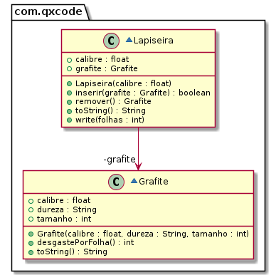

# Lapiseira e Grafite


<!--TOC_BEGIN-->
- [Requisitos](#requisitos)
- [Shell](#shell)
- [Diagrama](#diagrama)
- [Main não interativa](#main-não-interativa)
- [Ajuda](#ajuda)

<!--TOC_END-->

Faça o modelo de uma lapiseira que pode conter um único grafite.

## Requisitos
- Iniciar lapiseira
    - Inicia uma lapiseira de determinado calibre sem grafite.
- Inserir grafite
    - Insere um grafite passando
        - o calibre: float.
        - a dureza: string.
        - o tamanho em mm: int.
    - Não deve aceitar um grafite de calibre não compatível.
- Remover grafite
    - Retira o grafite se houver algum.
- Escrever folha
    - Não é possível escrever se não há grafite.
    - Quanto mais macio o grafite, mais rapidamente ele se acaba. Para simplificar, use a seguinte regra:
        - Grafite HB: 1mm por folha.
        - Grafite 2B: 2mm por folha.
        - Grafite 4B: 4mm por folha.
        - Grafite 6B: 6mm por folha.
        
    - Se o grafite acabar, defina o objeto grafite como `null`.
    - Se não houver grafite suficiente para terminar as folhas, avise que o texto ficou incompleto e informe quantas folhas completas foi possível escrever.
    - Avise quando o grafite acabar.


## Shell

```bash
#__case inserindo grafites
$init 0.5
$show
calibre: 0.5, grafite: null
$inserir 0.7 2B 50
fail: calibre incompatível
$inserir 0.5 2B 50
$show
calibre: 0.5, grafite: [0.5:2B:50]
$end
```

```bash
#__case inserindo e removendo
$init 0.3
$inserir 0.3 2B 50
$show
calibre: 0.3, grafite: [0.3:2B:50]
$inserir 0.3 4B 70
fail: ja existe grafite
$show
calibre: 0.3, grafite: [0.3:2B:50]
$remover
$inserir 0.3 4B 70
$show
calibre: 0.3, grafite: [0.3:4B:70]
$end
```

```bash
#__case escrevendo 1
$init 0.9
$inserir 0.9 4B 4
$write 1
warning: grafite acabou
$show
calibre: 0.9, grafite: null
$inserir 0.9 4B 30
$write 6
$show
calibre: 0.9, grafite: [0.9:4B:6]
$write 3
fail: folhas escritas completas: 1
warning: grafite acabou
$show
calibre: 0.9, grafite: null
$end
```

```bash
#__case escrevendo 2
$init 0.9
$inserir 0.9 2B 15
$show
calibre: 0.9, grafite: [0.9:2B:15]
$write 4
$show
calibre: 0.9, grafite: [0.9:2B:7]
$write 4
fail: folhas escritas completas: 3
warning: grafite acabou
$show
calibre: 0.9, grafite: null
$end
```


## Diagrama



***
## Main não interativa
```java
//case inserindo grafites
Lapiseira lapiseira = new Lapiseira(0.5f);
System.out.println(lapiseira);
//calibre: 0.5, grafite: null
lapiseira.inserir(new Grafite(0.7f, 2B, 50));
//fail: calibre incompatível
lapiseira.inserir(new Grafite(0.5f, 2B, 50));
System.out.println(lapiseira);
//calibre: 0.5, grafite: [0.5:2B:50]

//case inserindo e removendo
lapiseira = new Lapiseira(0.3f);
lapiseira.inserir(new Grafite(0.3f, 2B, 50));
System.out.println(lapiseira);
//calibre: 0.3, grafite: [0.3:2B:50]
lapiseira.inserir(new Grafite(0.3f, 4B, 70));
//fail: ja existe grafite
System.out.println(lapiseira);
//calibre: 0.3, grafite: [0.3:2B:50]
lapiseira.remover();
lapiseira.inserir(new Grafite(0.3f, 4B, 70));
System.out.println(lapiseira);
//calibre: 0.3, grafite: [0.3:4B:70]

//case escrevendo 1
lapiseira = new Lapiseira(0.9f);
lapiseira.inserir(new Grafite(0.9f, 4B, 4);
lapiseira.write(1);
//warning: grafite acabou
System.out.println(lapiseira);
//calibre: 0.9, grafite: null
lapiseira.inserir(new Grafite(0.9f, 4B, 30);
lapiseira.write(6);
System.out.println(lapiseira);
//calibre: 0.9, grafite: [0.9:4B:6]
lapiseira.write(3);
//fail: folhas escritas completas: 1
//warning: grafite acabou
System.out.println(lapiseira);
//calibre: 0.9, grafite: null

//case escrevendo 2
lapiseira = new Lapiseira(0.9f);
lapiseira.inserir(new Grafite(0.9f, 2B, 15));
System.out.println(lapiseira);
//calibre: 0.9, grafite: [0.9:2B:15]
lapiseira.write(4);
System.out.println(lapiseira);
//calibre: 0.9, grafite: [0.9:2B:7]
lapiseira.write(4);
//fail: folhas escritas completas: 3
//warning: grafite acabou
System.out.println(lapiseira);
//calibre: 0.9, grafite: null

```

## Ajuda

Se tiver muita dificuldade no método `write`, siga a ideia abaixo. Mas não se dê por vencido. Antes de copiar, tente fazer por você mesmo.

```python
def write(folhas):
    if grafite == null:
        print "fail: nao existe grafite"
        return
    
    total = grafite.desgastePorFolha() * folhas
    if grafite.tamanho > total: # tem suficiente
        grafite.tamanho -= total
        return
    if grafite.tamanho < total: # nao tem suficiente
        qtd = grafite.tamanho / grafite.desgastePorFolha() # divisao inteira
        print "fail: folhas escritas completas: " + qtd
    print "warning: grafite acabou"
    grafite = null
```
