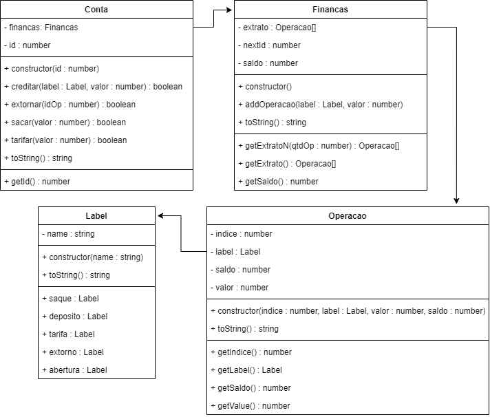

# Tarifas - Agência 1

<!--TOC_BEGIN-->
- [Requisitos](#requisitos)
- [Shell](#shell)
- [Diagrama UML](#diagrama-uml)
- [Main em Java](#main-em-java)
- [Dicas](#dicas)
- [Recursos Extras](#recursos-extras)

<!--TOC_END-->


O objetivo dessa atividade é implementar uma classe responsável por gerenciar a conta bancária de um único cliente. Faremos operações de saque, depósito e extrato.

## Requisitos

- **Iniciar**
    - Iniciar a conta passando número da conta.
    - Se a conta já existir, resete todos os valores para uma nova conta.
    - Verificar saldo.
- **Saque, Depósito e Tarifas**
    - Verifique se o valor é válido.
    - No caso da tarifa, o valor final de saldo poderá ser negativo.
    - No caso do saque, verifique se há saldo suficiente efetuar a operação. 
- **Retornar o extrato**.
    - Extrato completo
        - Retornar todas as movimentações da conta desde a abertura
        - A descrição pode ser "abertura", "saque", "deposito", "tarifa", "extorno".
        - Os saques devem ter valor negativo e os depósitos positivos.
- **Extrato parcial**
      - Mostre as últimas N operações do extrato.
- **Extornar tarifas**.
    - Deve ser possível extornar, pagando de volta, tarifas passando uma lista de índices.
    - Apenas efetue a operação de extorno dos índices válidos que forem tarifas.

***
## Shell

```bash
#__case iniciar
$init 100
$show 
conta:100 saldo:0

#__case depositar
$deposito 100
$deposito -10
fail: valor invalido
$show
conta:100 saldo:100

#__case debito
$saque 20
$tarifa 10
$show
conta:100 saldo:70
$saque 150
fail: saldo insuficiente
$saque 30
$tarifa 5
$deposito 5
$tarifa 1
$show
conta:100 saldo:39

#__case extrato
#extrato mostra todas as operações desde a abertura da conta
$extrato
 0: abertura:    0:    0
 1: deposito:  100:  100
 2:    saque:  -20:   80
 3:   tarifa:  -10:   70
 4:    saque:  -30:   40
 5:   tarifa:   -5:   35
 6: deposito:    5:   40
 7:   tarifa:   -1:   39

#__case extrato n
#extratoN mostra as ultimas N operacoes
$extratoN 2
 6: deposito:    5:   40
 7:   tarifa:   -1:   39

#__case extornar
$extornar 1 5 7 50
fail: indice 1 nao e tarifa
fail: indice 50 invalido

#__case novo extrato
$extrato
 0: abertura:    0:    0
 1: deposito:  100:  100
 2:    saque:  -20:   80
 3:   tarifa:  -10:   70
 4:    saque:  -30:   40
 5:   tarifa:   -5:   35
 6: deposito:    5:   40
 7:   tarifa:   -1:   39
 8:  extorno:    5:   44
 9:  extorno:    1:   45

#__case extrato tarifa
$tarifa 50
$extratoN 2
 9:  extorno:    1:   45
10:   tarifa:  -50:   -5

$end
```

***
## Diagrama UML


***
## Main em Java
```java
public static void main(String[] args) {
    Conta conta = new Conta(100);
    System.out.println(conta);
// conta:100 saldo:0
    conta.depositar(100);
    conta.depositar(-10);
// fail: valor invalido

    System.out.println(conta);
// conta:100 saldo:100
    conta.saque(20);
    conta.tarifa(10);
    System.out.println(conta);
// conta:100 saldo:70
    conta.saque(150);
// fail: saldo insuficiente
    conta.saque(30);
    conta.tarifa(5);
    conta.depositar(5);
    conta.tarifa(1);
    System.out.println(conta);
// conta:100 saldo:39
    for(Operacao op : conta.extrato())
        System.out.println(op);
/*
0: abertura:    0:    0
1: deposito:  100:  100
2:    saque:  -20:   80
3:   tarifa:  -10:   70
4:    saque:  -30:   40
5:   tarifa:   -5:   35
6: deposito:    5:   40
7:   tarifa:   -1:   39
*/
    for(Operacao op : conta.extratoN(2))
            System.out.println(op);
/*
6: deposito:    5:   40
7:   tarifa:   -1:   39
*/
    for(int id : Arrays.asList(1, 5, 7, 50))
        conta.extornar(id);
/*
fail: indice 1 nao e tarifa
fail: indice 50 invalido
*/
    for(Operacao op : conta.extrato())
        System.out.println(op);
/*
0: abertura:    0:    0
1: deposito:  100:  100
2:    saque:  -20:   80
3:   tarifa:  -10:   70
4:    saque:  -30:   40
5:   tarifa:   -5:   35
6: deposito:    5:   40
7:   tarifa:   -1:   39
8:  extorno:    5:   44
9:  extorno:    1:   45
*/
    conta.tarifa(5);
    conta.extratoN(2);
/*
9:  extorno:    1:   45
10:   tarifa:  -50:   -5
*/
}

```

***

## Dicas
- Nas operações de saque, depósito, tarifa, você precisa criar uma operação e adicionar no extrato para registrar essa operação. Cada operação deve ter um id único e incremental. O atributo nextId da classe conta deve ser utilizado para numerar as operações. 
- O método `adicionarOperacao(descricao, valor)` serve para fazer isso.
```java
void adicionarOperacao(descricao, valor)
    cria a operacao(nextId, descricao, valor, getSaldo)
    incrementa o nextId
    adiciona a operacoa criada no extrato
```
- Então, no saque, depósito, basta você invocar o método `adicionarOperacao`
```java
void saque(float valor)
    ...
    this.saldo -= valor;
    adicionarOperacao("saque", -valor);
    ...
}
```
- Para processar várias tarifas em linha, utilize um `for` na main.

```java
class Conta{
    void extornar(int indice){
        //a lógica de extorna UMA tarifa
        ...
    }
}

main(){
    ...
    String[] ui = line.split(" ")
    ...
    if(ui[0].equals("extornar"){ //extornar 1 4 7 21
        for(int i = 1; i < ui.lenght; i++)
            conta.extornar(Integer.parseInt(ui[i]));
    ...
}
```


***
## Recursos Extras
- [Comandos de teste](resources/testes.tio)