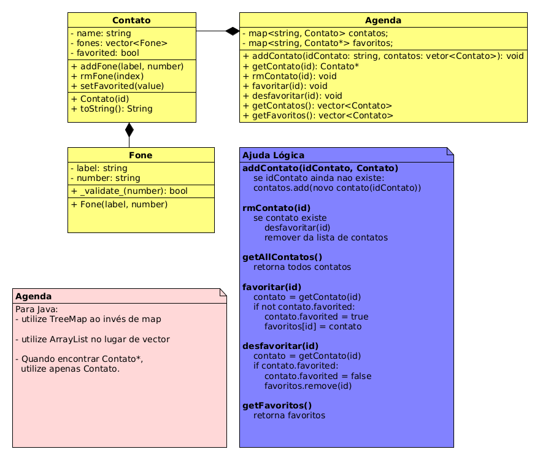

# Agenda 3 - Favoritos


<!--TOC_BEGIN-->
- [Agenda 3 - Favoritos](#agenda-3---favoritos)
  - [Requisitos Novos](#requisitos-novos)
  - [Shell](#shell)
  - [Diagrama UML](#diagrama-uml)
  - [Ajuda](#ajuda)

<!--TOC_END-->

Ampliando a atividade de agenda 2, vamos criar uma agenda que gerencia os nossos contatos.


## Requisitos Novos

O sistema deverá:

- Mostrando
    - Ordenar os contatos pelo idContato.
    - Se o contato não for favorito use - antes do idContato.
    - Marque os contatos que são favoritados com um @ antes do idContato. 

- Favoritando
    - Favoritar contatos
    - Desfavoritar contatos.
    - Mostrar apenas os favoritos.

## Shell

```bash
#__case iniciando agenda
$add eva oi:8585 claro:9999
$add ana tim:3434 
$add ana casa:4567 oi:8754
$add bia vivo:5454
$add rui casa:3233
$add zac fixo:3131

$agenda
- ana [0:casa:4567][1:oi:8754]
- bia [0:vivo:5454]
- eva [0:oi:8585][1:claro:9999]
- rui [0:casa:3233]
- zac [0:fixo:3131]

#__case favoritando
$fav eva
$fav ana
$fav ana
$fav zac
$fav rex
fail: contato rex nao existe

$agenda
@ ana [0:casa:4567][1:oi:8754]
- bia [0:vivo:5454]
@ eva [0:oi:8585][1:claro:9999]
- rui [0:casa:3233]
@ zac [0:fixo:3131]

#__case lista de favoritos
$favorited
@ ana [0:casa:4567][1:oi:8754]
@ eva [0:oi:8585][1:claro:9999]
@ zac [0:fixo:3131]

#__case removendo contato
$rmContato zac

$agenda
@ ana [0:casa:4567][1:oi:8754]
- bia [0:vivo:5454]
@ eva [0:oi:8585][1:claro:9999]
- rui [0:casa:3233]

$favorited
@ ana [0:casa:4567][1:oi:8754]
@ eva [0:oi:8585][1:claro:9999]

#__case desfavoritando
$unfav ana

$favorited
@ eva [0:oi:8585][1:claro:9999]

$agenda
- ana [0:casa:4567][1:oi:8754]
- bia [0:vivo:5454]
@ eva [0:oi:8585][1:claro:9999]
- rui [0:casa:3233]
$end
```


***
## Diagrama UML


***
## Ajuda
- Favoritar
    - Favoritar no nosso exemplo, implica tanto em colocar o contato na lista de favoritos, como também definir o atribuito favorito do contato para `true`. - Você pode utilizar um vetor de Contatos para guardar os favoritos ou uma estrutura chave valor.
- Remover
    - Quando remover um contato, lembre de removê-lo dos favoritos se necessário.
- Desfavoritar
    - Quando desfavoritar um contato, lembre de tanto remover da lista de favoritos como também alterar o valor do atributo `favorited` no próprio contato.


```java
Agenda agenda = new Agenda();
agenda.addContato("eva", Arrays.asList(new Fone("oio", 8585), new Fone("cla", 9999)));
agenda.addContato("ana", Arrays.asList(new Fone("Tim", 3434)));
agenda.addContato("bia", Arrays.asList(new Fone("viv", 5454)));
agenda.addContato("ana", Arrays.asList(new Fone("cas", 4567), new Fone("oio", 8754)));
System.out.println(agenda);
/*
- ana [0:casa:4567][1:oi:8754]
- bia [0:vivo:5454]
- eva [0:oi:8585][1:claro:9999]
- rui [0:casa:3233]
- zac [0:fixo:3131]
*/

//case favoritando
agenda.favoritar("eva");
agenda.favoritar("ana");
agenda.favoritar("ana");
agenda.favoritar("zac");
agenda.favoritar("rex");
//fail: contato rex nao existe
System.out.println(agenda);
/*
@ ana [0:casa:4567][1:oi:8754]
- bia [0:vivo:5454]
@ eva [0:oi:8585][1:claro:9999]
- rui [0:casa:3233]
@ zac [0:fixo:3131]
*/

//case lista de favoritos
for(Favoritos fav in agenda.getFavoritos){
    System.out.println(fav);
}
/*
@ ana [0:casa:4567][1:oi:8754]
@ eva [0:oi:8585][1:claro:9999]
@ zac [0:fixo:3131]
*/

//case removendo contato
agenda.rmContato("zac");
System.out.println(agenda);
/*
@ ana [0:casa:4567][1:oi:8754]
- bia [0:vivo:5454]
@ eva [0:oi:8585][1:claro:9999]
- rui [0:casa:3233]
*/
for(Favoritos fav in agenda.getFavoritos){
    System.out.println(fav);
}
/*
@ ana [0:casa:4567][1:oi:8754]
@ eva [0:oi:8585][1:claro:9999]
*/

//case desfavoritando
agenda.unfav("ana");
for(Favoritos fav in agenda.getFavoritos){
    System.out.println(fav);
}
//@ eva [0:oi:8585][1:claro:9999]
System.out.println(agenda);
/*
- ana [0:casa:4567][1:oi:8754]
- bia [0:vivo:5454]
@ eva [0:oi:8585][1:claro:9999]
- rui [0:casa:3233]
*/
```
