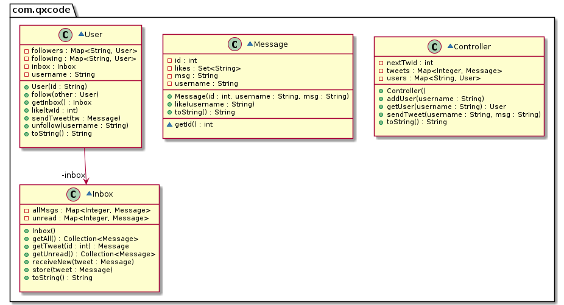

# Twitter (Associação reflexiva, envio de mensagens)


<!--TOC_BEGIN-->
- [Habilidades](#habilidades)
- [Funcionalidades](#funcionalidades)
- [Comandos e Exemplos](#comandos-e-exemplos)
- [Diagrama](#diagrama)
- [Esqueleto](#esqueleto)
<!--TOC_END-->

Vamos implementar o modelo do twitter. Os usuários se cadastram e podem follow outros usuários do sistema. Ao twittar, a mensagem vai para timeline de todas as pessoas que a seguem.

***
## Habilidades

- Nessa atividade o mesmo objeto User estará armazenado no repositório de usuários, como também nas listas de seguidores e seguidos do próprio usuário. 
- Também o objeto Tweet estará tanto na lista de meusTweets do usuário que postou como na timeline de seus seguidores. Dado que é o mesmo objeto tweet, quando uma usuário dá like e altera o objeto, todos vêem quem deu o like. 
- Tweets são gerados através de uma Classe Geradora de Tweets.
- Também User utiliza um contador de mensagem não lidas para mostrar apenas as novas mensagens.

***
## Funcionalidades
- **[2.0 P] Repositório de Usuários**
    - Adicionar usuário passando username.
    - Mostrar os usuários cadastrados.

- **[2.0 P] Seguir e ser seguido**
    - Seguir um outro usuário cadastrado.
    - Mostrar a lista de seguidores.
    - Mostrar a lista de seguidos.

- **[4.0 P] Voa passaarinho**
    - twittar um tweet com várias palavras.
        - o id de um tweet é único globalmente.
        - o tweet de um usuário vai para o início da timeline de seus seguidores.
        - o mesmo tweet vai também para sua própria lista de minhas mensagens.
    - mostrar as mensagens que você enviou.

- **[1.0 P] Quais as novidades?**
  - Mostrar apenas as mensagens não lidas.

- **[1.0 P] Gostei dei like**
    - Dar like num tweet da sua timeline.

***
## Comandos e Exemplos

```bash
##################################
# Repositório de Usuários
##################################
#__case cadastrar
$addUser goku
$addUser sara
$addUser tina
$show
goku
  seguidos   []
  seguidores []
sara
  seguidos   []
  seguidores []
tina
  seguidos   []
  seguidores []

##################################
# Seguir e ser seguido
##################################
#__case seguir

$follow goku sara
$follow goku tina
$follow sara tina
$show
goku
  seguidos   [sara, tina]
  seguidores []
sara
  seguidos   [tina]
  seguidores [goku]
tina
  seguidos   []
  seguidores [goku, sara]

##################################
# Voa passarinho
##################################
#__case twittar
#twittar _userId _msg

$twittar sara hoje estou triste
$twittar tina ganhei chocolate
$twittar sara partiu ru
$twittar tina chocolate ruim
$twittar goku internet maldita

$timeline goku
0:sara (hoje estou triste)
1:tina (ganhei chocolate)
2:sara (partiu ru)
3:tina (chocolate ruim)
4:goku (internet maldita)

$timeline tina 
1:tina (ganhei chocolate)
3:tina (chocolate ruim)

$timeline sara
0:sara (hoje estou triste)
1:tina (ganhei chocolate)
2:sara (partiu ru)
3:tina (chocolate ruim)

##################################
# Gostei dei like
##################################
#__case like
#like _username _idTw

$like sara 1
$like goku 1
$like sara 3

$timeline sara
0:sara (hoje estou triste)
1:tina (ganhei chocolate) [goku, sara]
2:sara (partiu ru)
3:tina (chocolate ruim) [sara]

$timeline goku
0:sara (hoje estou triste)
1:tina (ganhei chocolate) [goku, sara]
2:sara (partiu ru)
3:tina (chocolate ruim) [sara]
4:goku (internet maldita)

#__case unfollow
$unfollow goku tina
$show
goku
  seguidos   [sara]
  seguidores []
sara
  seguidos   [tina]
  seguidores [goku]
tina
  seguidos   []
  seguidores [sara]
##################################
# Errinhos
##################################
#__case erros

# lembre de tratar erros como
$timeline bruno
fail: usuario nao encontrado
$follow goku kuririm
fail: usuario nao encontrado
$like sara 4
fail: tweet nao existe
$end
##################################
# FIM FIM FIM FIM FIM FIM FIM FIM#
##################################
```

***
## Diagrama



***
## Esqueleto

<!--FILTER Solver.java java-->
```java
class MessageException extends RuntimeException {
    public MessageException(String message);
}
class Message {
    private int id;
    private String username;
    private String msg;
    private Set<String> likes; //Using a Set would eliminate duplicates
    int getId();
    //Initialize all attributes
    public Message(int id, String username, String msg);
    //add username to likes collection
    public void like(String username);
    //mount output string
    public String toString();
}
class Inbox {
    private Map<Integer, Message> unread; //store unread tweets
    private Map<Integer, Message> allMsgs; //store read tweets
    public Inbox();
    //stores message both in unread as in allMsgs
    public void receiveNew(Message tweet);
    //stores message as a readed Message
    public void store(Message tweet);
    //return unread and clean unread Msgs
    public Collection<Message> getUnread();
    //return all messages
    public Collection<Message> getAll();
    //search for a tweet with this id and return it or throw a MessageException
    public Message getTweet(int id);
    //return allMsgs
    public String toString();
}
class User{
    private String username;
    private Map<String, User> followers; //os meus seguidores
    private Map<String, User> following; //aqueles que eu sigo
    private Inbox inbox;
    // Initialize all attributes
    public User(String id);
    //if it's still not following
    //add other to this.following
    //add this to other.followers
    public void follow(User other);
    //get the User other from following using username parameter
    //if other is null then return
    //remove other from following
    //remove this from other.followers
    public void unfollow(String username);
    //retrieve the tweet from inbox and uses method like
    public void like(int twId);
    //return inbox object
    public Inbox getInbox();
    //Store the message in the user's inbox
    //Put the message as an unread message in each of the follower's inbox
    public void sendTweet(Message tw);
    //show all followers and following by name
    public String toString();
}
class Controller {
    private Map<String, User> users;
    private Map<Integer, Message> tweets;
    private int nextTwId = 0;
    public Controller();
    //add User if not found
    public void addUser(String username);
    //get user by username or throw a MessageException
    public User getUser(String username);
    //get the user with getUser
    //create a new Tweet using nextTwId and stores in tweets map
    //call user.sendTweet to deliver the tweet
    public void sendTweet(String username, String msg);
    //return the toString of allUsers
    public String toString();
}
public class Solver {
    public static void main(String[] args) {
        Scanner scanner = new Scanner(System.in);
        Controller sistema = new Controller();
        while(true) {
            String line = scanner.nextLine();
            System.out.println("$" + line);
            List<String> ui = Arrays.asList(line.split(" "));
            try {
                if (ui.get(0).equals("end")) {
                    break;
                } else if (ui.get(0).equals("addUser")) {
                    sistema.addUser(ui.get(1));
                } else if (ui.get(0).equals("show")) {
                    System.out.println(sistema);
                } else if (ui.get(0).equals("follow")) {//goku tina
                    sistema.getUser(ui.get(1)).follow(sistema.getUser(ui.get(2)));
                } else if (ui.get(0).equals("twittar")) {//goku msg
                    sistema.sendTweet(ui.get(1), ui.stream().skip(2).collect(Collectors.joining(" ")));
                } else if (ui.get(0).equals("unread")) {//user
                    System.out.println(sistema.getUser(ui.get(1))); 
                } else if (ui.get(0).equals("timeline")) {//user
                    System.out.println(sistema.getUser(ui.get(1)).getInbox());
                } else if (ui.get(0).equals("like")) {//goku 
                    sistema.getUser(ui.get(1)).like(Integer.parseInt(ui.get(2)));
                } else if (ui.get(0).equals("unfollow")) {//goku tina
                    sistema.getUser(ui.get(1)).unfollow(ui.get(2));
                } else {
                    System.out.println("fail: comando invalido");
                }
            } catch(MessageException rt) {
                System.out.println(rt.getMessage());
            }
        }
        scanner.close();
    }
}
```
<!--FILTER_END-->

