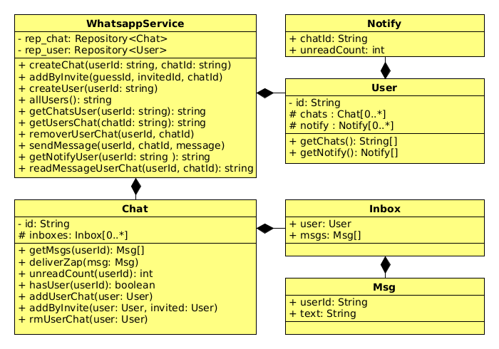

# Whatsapp I - Chat Grupo

<!--TOC_BEGIN-->
- [Funcionalidades](#funcionalidades)
    - [Seu sistema deverá:](#seu-sistema-deverá)
- [Shell](#shell)
- [Guia de Resolução](#guia-de-resolução)
- [Main não interativa](#main-não-interativa)
- [Créditos](#créditos)

<!--TOC_END-->


## Funcionalidades
### Seu sistema deverá:

- Adicionar usuário passando username.
- Mostrar os usuários cadastrados.
- Criar chat(grupo) para mandar mensagens
    - O nome do Chat deve ser único no sistema.
    - Quando um usuário cria um Chat, o Chat começa com o usuário que criou.
- Ver os Chats de um usuario.
- Adicionar pessoas a um chat.
    - A pessoa que adiciona deve já estar no chat.
- Ver quem está em um chat.
- Sair de um chat.
- Mandar mensagens para um grupo.
    - A pessoa que manda as mensagens, tem que estar no grupo.
    - Apenas quem está no grupo, poderá ler as mensagens.
- Ler as mensagens de um grupo.    
    - Um usuário pode ser as mensagens do grupo se ele está no grupo.
    - Ao pedir as mensagens, o usuário receberá as mensagens não lidas que ele tem no grupo.
    - Ao pedir as mensagens, o usuário não recebe as mensagens que ele mesmo enviou.
- Ao pedir a lista de notificações, o usuário vê ao lado de cada grupo se ele possui mensagens não lidas.
---
## Shell

```sh
#__case adicionar e mostrar usuários 
# O comando "$addUser nomeUsuario" cria um novo usuário.
# O comando "$allUsers" mostra todos usuários.
$addUser goku
$addUser sara
$addUser tina
$allUsers
[goku sara tina]

#__case novo Chat, mostrar chats do usuário
# O comando "$newChat nomeUser nomeChat" cria um novo chat.
# O comando "$chats nomeUser" mostra os chats usuário.

$newChat goku guerreiros
$newChat goku homens
$newChat sara familia

# testando chats duplicados
$newChat sara guerreiros
fail: chat guerreiros ja existe

$chats goku
[guerreiros homens]
$chats sara
[familia]
$chats tina
[]

#- Adicionar pessoas a um grupo.
#    - A pessoa que adiciona deve já estar no grupo.
#- Ver quem está em um grupo.
#- Sair de um grupo.

#__case invite
$invite goku sara guerreiros
$invite sara tina guerreiros
$invite tina goku familia
fail: user tina nao esta em chat familia
$chats sara
[guerreiros familia]
$chats tina
[guerreiros]
$chats goku
[guerreiros homens]
$users guerreiros
[goku sara tina]
$users familia
[sara]

#__case leaving
$leave sara guerreiros
$users guerreiros
[goku tina]
$chats sara
[familia]

#- Mandar mensagens para um grupo.
#    - A pessoa que manda as mensagens, tem que estar no grupo.
#    - Apenas quem está no grupo, poderá ler as mensagens.
#- Ler as mensagens de um grupo.    
#    - Um usuário pode ser as mensagens do grupo se ele está no grupo.
#    - Ao pedir as mensagens, o usuário receberá as mensagens não lidas que ele tem no grupo.
#    - Ao pedir as mensagens, o usuário não recebe as mensagens que ele mesmo enviou.
#- Ao pedir a lista de notificações, o usuário vê ao lado de cada grupo se ele possui mensagens não lidas.

#__case mensagens
$zap goku guerreiros oi, eu sou o goku
$zap tina guerreiros oi goku

$notify goku
[guerreiros(1) homens]
$notify tina
[guerreiros(1)]

$ler goku guerreiros
[tina: oi goku]
$ler tina guerreiros
[goku: oi, eu sou o goku]

$ler sara guerreiros
fail: user sara nao esta no chat guerreiros

$zap goku guerreiros vamos sair tina?
$zap tina guerreiros voce ta com fome goku?
$zap goku guerreiros to com saudade de voce.

$notify tina
[guerreiros(2)]
$notify goku
[guerreiros(1) homens]

$ler goku guerreiros
[tina: voce ta com fome goku?]
$ler tina guerreiros
[goku: vamos sair tina?]
[goku: to com saudade de voce.]
$end
```

- Opcionais:
    - Enviar uma mensagem do sistema avisando quando um usuário entra ou sai de um Chat.

---

## Guia de Resolução
[GUIA](_guide.md)


 
---

## Main não interativa
```java
//case init
WhatsappService whatsapp = new WhatsappService();
whatsapp.createUser("goku");
whatsapp.createUser("sara");
whatsapp.createUser("tina");
System.out.println(whatsapp.allUsers());
//[goku sara tina]
whatsapp.createChat("goku", "guerreiros");
whatsapp.createChat("goku", "homens");
whatsapp.createChat("sara", "familia");

whatsapp.createChat("sara", "guerreiros");
//fail: chat guerreiros ja existe

System.out.println(whatsapp.getChatsUser("goku"));
//[guerreiros homens]
System.out.println(whatsapp.getChatsUser("sara"));
//[familia]
System.out.println(whatsapp.getChatsUser("tina"));
//[]

//case invite
whatsapp.addByInvite("goku", "sara", "guerreiros");
whatsapp.addByInvite("sara", "tina", "guerreiros");
whatsapp.addByInvite("tina", "goku", "familia");
//fail: user tina nao esta em chat familia
System.out.println(whatsapp.getChatsUser("sara"));
//[guerreiros familia]
System.out.println(whatsapp.getChatsUser("tina"));
//[guerreiros]
System.out.println(whatsapp.getChatsUser("goku"));
//[guerreiros homens]
System.out.println(whatsapp.getUsersChat("guerreiros"));
//[goku sara tina]
System.out.println(whatsapp.getUsersChat("familia"));
//[sara]

//case leaving
whatsapp.removerUserChat("sara", "guerreiros");
System.out.println(whatsapp.getUsersChat("guerreiros"));
//[goku tina]
System.out.println(whatsapp.getChatsUser("sara"));
//[familia]

//case mensagens
whatsapp.sendMessage("goku", "guerreiros", "oi, eu sou o goku");
whatsapp.sendMessage("tina", "guerreiros", "oi goku");

System.out.println(whatsapp.getNotifyUser("goku"));
//[guerreiros(1) homens]
System.out.println(whatsapp.getNotifyUser("tina"));
//[guerreiros(1)]

System.out.println(whatsapp.readMessageUserChat("goku", "guerreiros"));
//[tina: oi goku]

System.out.println(whatsapp.readMessageUserChat("tina", "guerreiros"));
//[goku: oi, eu sou o goku]

System.out.println(whatsapp.readMessageUserChat("sara", "guerreiros"));
//fail: user sara nao esta no chat guerreiros


whatsapp.sendMessage("goku", "guerreiros", "vamos sair tina?");
whatsapp.sendMessage("tina", "guerreiros", "voce ta com fome goku?");
whatsapp.sendMessage("goku", "guerreiros", "to com saudade de voce.");

System.out.println(whatsapp.getNotifyUser("tina"));
//[guerreiros(2)]
System.out.println(whatsapp.getNotifyUser("goku"));
//[guerreiros(1) homens]

System.out.println(whatsapp.readMessageUserChat("goku", "guerreiros"));
//[tina: voce ta com fome goku?]
System.out.println(whatsapp.readMessageUserChat("tina", "guerreiros"));
//[goku: vamos sair tina?]
//[goku: to com saudade de voce.]
```
---
## Créditos

Fica o agradecimento para turma de POO DD 2017.2 que fez nascer essa atividade comigo.
