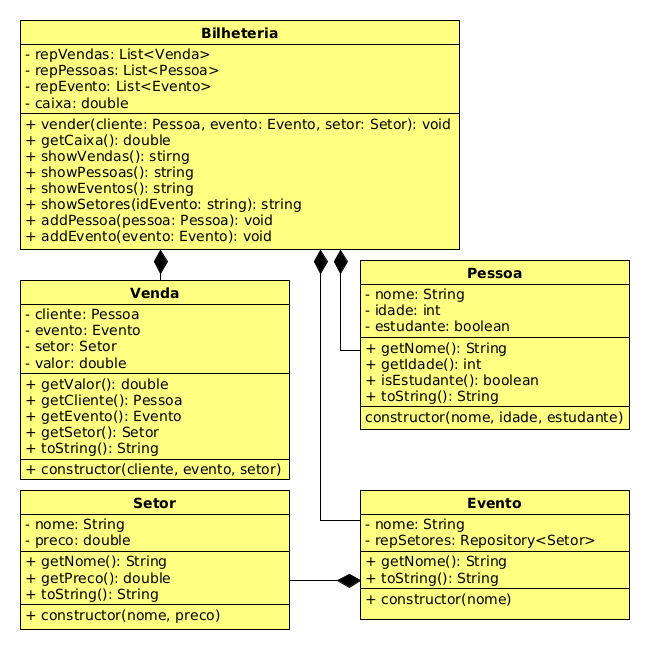

# Bilheteria


<!--TOC_BEGIN-->
- [Bilheteria](#bilheteria)
  - [Requisitos](#requisitos)
  - [Diagrama](#diagrama)
  - [Main não interativa](#main-não-interativa)

<!--TOC_END-->

Fazer vendas usando papel e caneta é coisa do passado. Você foi contratado para modernizar a bilheteria do seu bairro e trazer ela pro século XXI

Você deve desenvolver um sistema para gerenciar as vendas de uma bilheteria de shows.


## Requisitos

- Cadastrar uma pessoa pelo nome.
    - nome da pessoa é único
    - pessoa deve ter nome, idade e pode ou não ser estudante
- Mostrar todos os clientes

```sh
#__case cadastro pessoas
# addPessoa _nome _idade _estudante
$addPessoa steve 32 nao
$addPessoa tony 43 sim
$addPessoa steve 24 sim
fail: pessoa steve ja existe
$showP
[tony, 43, sim],
[steve, 32, nao]

#- Cadastrar evento pelo nome.
#    - Assim como pessoa, nome do evento é único
#    - Um evento pode ter vários setores
#- Cadastrar setor pelo nome.
#    - Setor tem nome e preço
#    - Setores do MESMO EVENTO não podem ter o mesmo nome
#- Mostrar evento e setores de um evento cadastrados

#__case cadastro eventos e setores

# addEvento _nome
$addEvento orappa
# addSetor _nome-evento _nome _preco
$addSetor orappa front 70
$addSetor orappa pista 35
$showE
[orappa]
$showS orappa
[front],
[pista]

#- Realizar venda
#    - Uma venda deve ter pessoa, evento, setor e preco
#    - O atributo preco da venda será obtido através do atributo preco do setor
#    - O identificador único da venda é o nome do cliente(Pessoa)
#    - Se o cliente for menor de 2 anos, não paga
#    - Se o cliente tiver até 12 anos ou for estudante, paga meia
#    - O valor da venda deve ser contabilizado em um caixa
#- Mostrar vendas realizadas e o valor atual em caixa

#__case vender ingressos

# vender _Pessoa _Evento _Setor
$vender tony orappa front
$vender steve orappa camarote
fail: setor camarote nao existe

#showV
$showV
[tony, orappa, front, 35,00]

#showC
$showC
R$ 35,00

$end
```
***
## Diagrama


 
---

## Main não interativa

```java
Bilheteria bilheteria = new Bilheteria();
bilheteria.addPessoa(new Pessoa("steve", 32, false));
bilheteria.addPessoa(new Pessoa("steve", 32, false));
bilheteria.addPessoa(new Pessoa("tony", 43, true));
bilheteria.addPessoa(new Pessoa("steve", 24, true));
//fail: pessoa steve ja existe
bilheteria.showPessoas();
//[tony, 43, sim],
//[steve, 32, nao]

bilheteria.addEvento(new Evento("orappa"));
bilheteria.addSetor("orappa", new Setor("front", 70f));
bilheteria.addSetor("orappa", new Setor("pista", 35));
bilheteria.showEvento();
//[orappa]
bilheteria.showSetor("orappa");
//[front],
//[pista]

bilheteria.vender("tony", "orappa", "front");
bilheteria.vender("steve", "orappa", "camarote");
//fail: setor camarote nao existe

bilheteria.showVenda();
//[tony, orappa, front, 35,00]

bilheteria.showCaixa();
//R$ 35,00
```