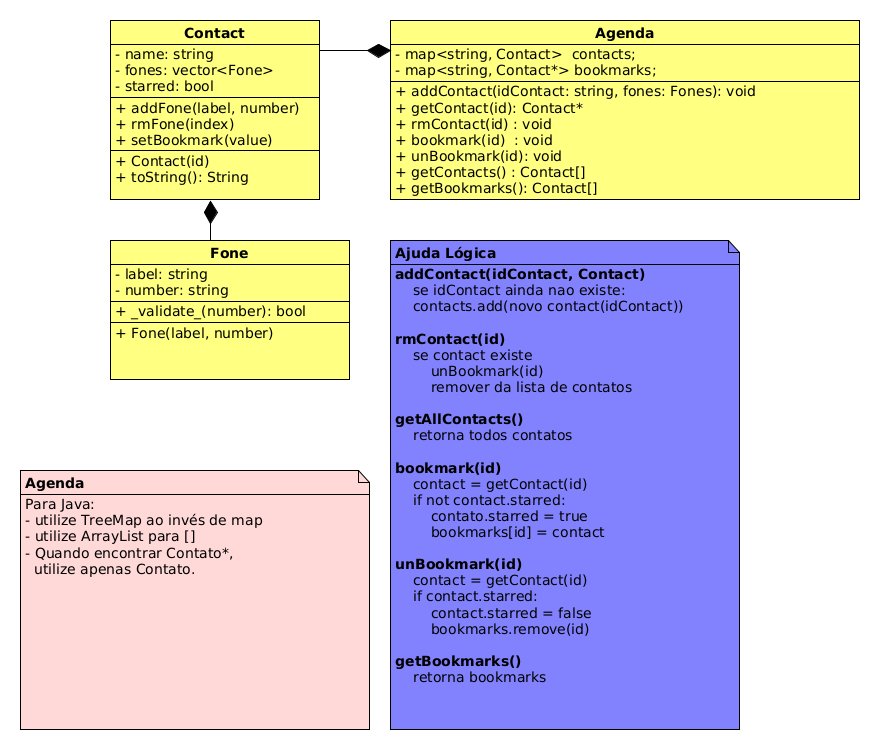

# ContatoStar - Agenda 4


<!--TOC_BEGIN-->
- [Requisitos](#requisitos)
- [Shell](#shell)
- [Diagrama UML](#diagrama-uml)

<!--TOC_END-->

Vamos reescrever a atividade dos Favoritos utilizando Herança.

Fique bem atendo ao diagrama e tente implementá-lo com exatidão.

## Requisitos

- Os mesmos do projeto Favoritos original.

## Shell

```bash
#__case iniciando agenda
$add eva oi:8585 claro:9999
$add ana tim:3434 
$add ana casa:4567 oi:8754
$add bia vivo:5454
$add rui casa:3233
$add zac fixo:3131

$show
- ana [0:tim:3434] [1:casa:4567] [2:oi:8754]
- bia [0:vivo:5454]
- eva [0:oi:8585] [1:claro:9999]
- rui [0:casa:3233]
- zac [0:fixo:3131]

#__case favoritando
$star eva
$star ana
$star ana
$star zac
$star rex
fail: contato rex nao existe

$show
@ ana [0:tim:3434] [1:casa:4567] [2:oi:8754]
- bia [0:vivo:5454]
@ eva [0:oi:8585] [1:claro:9999]
- rui [0:casa:3233]
@ zac [0:fixo:3131]

#__case lista de favoritos
$starred
@ ana [0:tim:3434] [1:casa:4567] [2:oi:8754]
@ eva [0:oi:8585] [1:claro:9999]
@ zac [0:fixo:3131]

#__case removendo contato
$rmContact zac

$show
@ ana [0:tim:3434] [1:casa:4567] [2:oi:8754]
- bia [0:vivo:5454]
@ eva [0:oi:8585] [1:claro:9999]
- rui [0:casa:3233]

$starred
@ ana [0:tim:3434] [1:casa:4567] [2:oi:8754]
@ eva [0:oi:8585] [1:claro:9999]

#__case desfavoritando
$unstar ana

$starred
@ eva [0:oi:8585] [1:claro:9999]

$show
- ana [0:tim:3434] [1:casa:4567] [2:oi:8754]
- bia [0:vivo:5454]
@ eva [0:oi:8585] [1:claro:9999]
- rui [0:casa:3233]
$end
```


***
## Diagrama UML



```java
Agenda agenda = new Agenda();
agenda.addContact("eva", Arrays.asList(new Fone("oio", 8585), new Fone("cla", 9999)));
agenda.addContact("ana", Arrays.asList(new Fone("Tim", 3434)));
agenda.addContact("bia", Arrays.asList(new Fone("viv", 5454)));
agenda.addContact("ana", Arrays.asList(new Fone("cas", 4567), new Fone("oio", 8754)));
System.out.println(agenda);
/*
- ana [0:casa:4567][1:oi:8754]
- bia [0:vivo:5454]
- eva [0:oi:8585][1:claro:9999]
- rui [0:casa:3233]
- zac [0:fixo:3131]
*/

//case favoritando
agenda.star("eva");
agenda.star("ana");
agenda.star("ana");
agenda.star("zac");
agenda.star("rex");
//fail: contato rex nao existe
System.out.println(agenda);
/*
@ ana [0:casa:4567][1:oi:8754]
- bia [0:vivo:5454]
@ eva [0:oi:8585][1:claro:9999]
- rui [0:casa:3233]
@ zac [0:fixo:3131]
*/

//case lista de favoritos
for(Favoritos fav in agenda.getStarred()){
    System.out.println(fav);
}
/*
@ ana [0:casa:4567][1:oi:8754]
@ eva [0:oi:8585][1:claro:9999]
@ zac [0:fixo:3131]
*/

//case removendo contato
agenda.rmContact("zac");
System.out.println(agenda);
/*
@ ana [0:casa:4567][1:oi:8754]
- bia [0:vivo:5454]
@ eva [0:oi:8585][1:claro:9999]
- rui [0:casa:3233]
*/
for(Contact fav in agenda.getStarred()){
    System.out.println(fav);
}
/*
@ ana [0:casa:4567][1:oi:8754]
@ eva [0:oi:8585][1:claro:9999]
*/

//case desfavoritando
agenda.unstar("ana");
for(Contact fav in agenda.getStarred()){
    System.out.println(fav);
}
//@ eva [0:oi:8585][1:claro:9999]
System.out.println(agenda);
/*
- ana [0:casa:4567][1:oi:8754]
- bia [0:vivo:5454]
@ eva [0:oi:8585][1:claro:9999]
- rui [0:casa:3233]
*/
```
