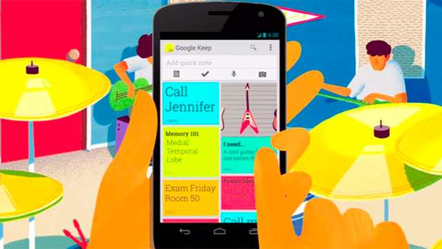

# Agenda Híbrida



Algum dia você já utilizou a agenda do seu telefone para guardar outra coisa além de contatos e telefones? Eu mesmo já utilizei a minha para guardar algumas notas e até números ou senhas. O objetivo da agenda híbrida é fazer uma agenda capaz de guardar e favoritar várias coisas além de contatos.

Você vai partir do projeto da agenda de contatos e seguir a seguinte sequência de implementações do projeto.


## Esqueleto

```java


class Agenda{
    - entries: Entry[]
    ---
    + addEntry(Entry entry)
    + rmEntry(id: String)  // remove a entrada
    + getEntries(): Entry[] // retorna todas as entradas

    
}

abstract class Entry{
    # id: string
    ---
    + setId(id:string): void
    + getId(): string    
}


class Contato extends Entry{
    - fones: Fone[]
    ---
    + addFone(fone: Fone)
    + rmFone(id)
    + toString()
}

class Fone{
    - operadora: string
    - numero: string
    ---
    + getOperadora():string
    + getNumero():string

}

class Note extends Entry {
    - text: string
    - itens: string[]
    ---
    + addItem(string item)
    + toString()
}


```